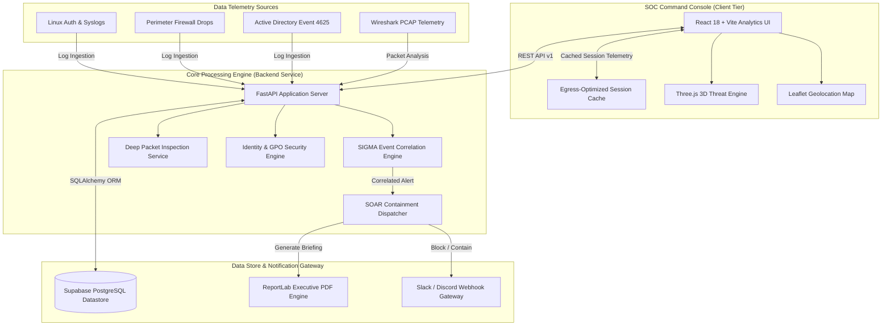
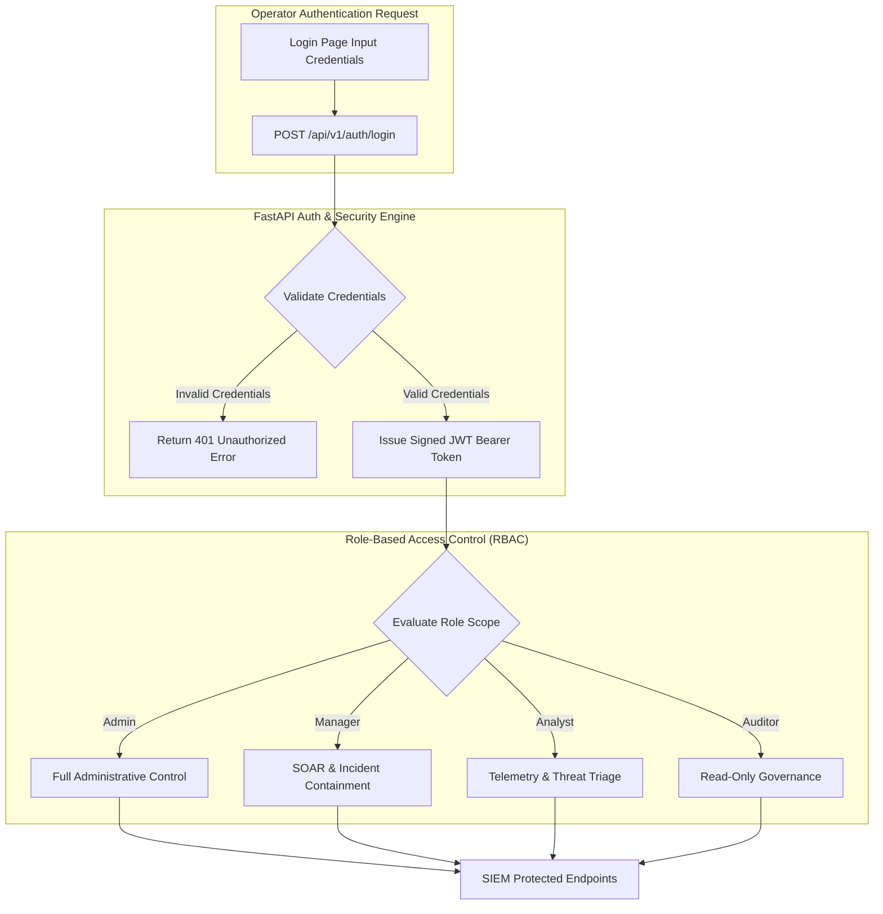
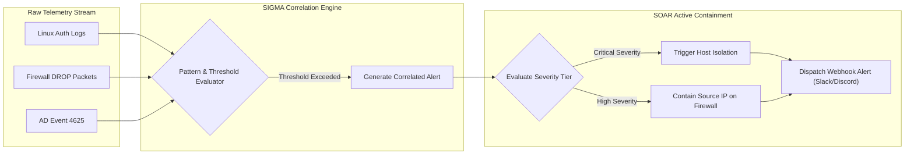
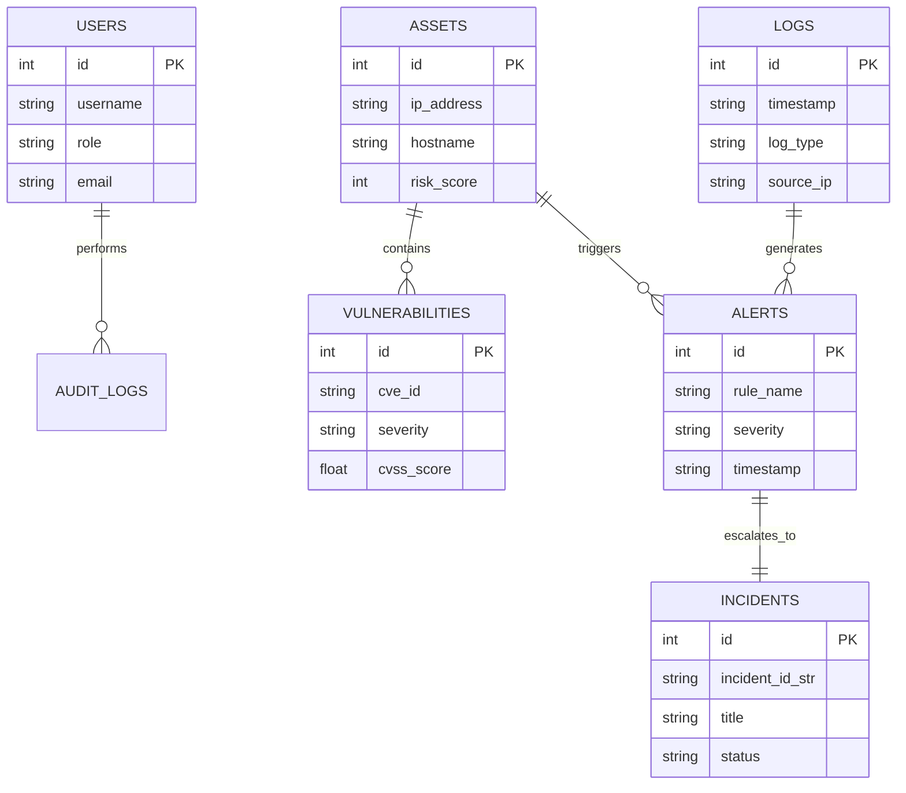
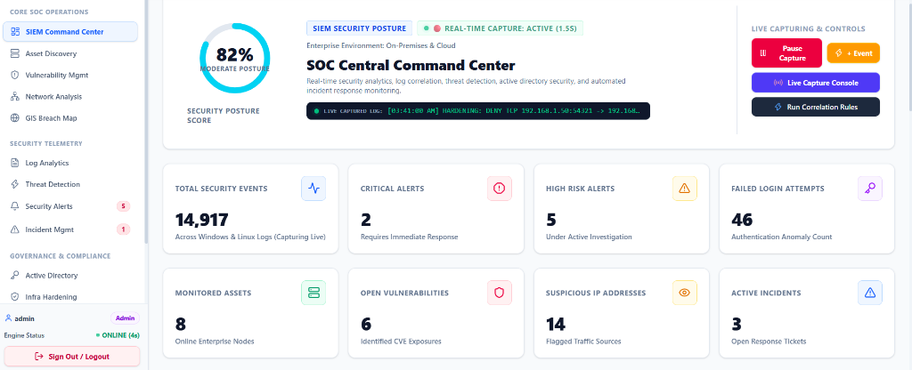
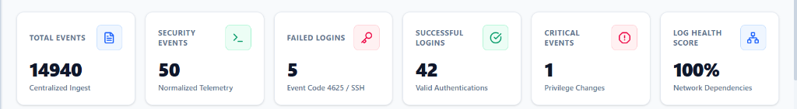
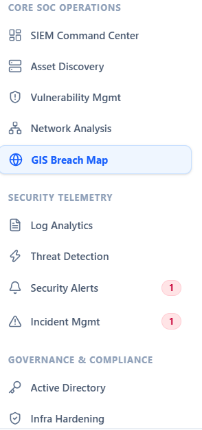

<div align="center">

# 🛡️ Unified Cyber Defense Platform — SIEM Command Center

### *Enterprise Security Information & Event Management (SIEM) Platform*
**CompTIA Security+ SY0-701 Capstone Demonstration & Real-Time SOC Engine**

[](https://unified-cyber-defence.netlify.app/)
[](https://github.com/kharedhruva-tech/Unified-Cyber-Defense-Platform-SIEM-Command-Center)
[](https://github.com/kharedhruva-tech/Unified-Cyber-Defense-Platform-SIEM-Command-Center)
[](https://react.dev/)
[](https://fastapi.tiangolo.com/)
[](https://supabase.com/)
[](LICENSE)

[🌐 **Production Command Center**](https://unified-cyber-defence.netlify.app/) • [📂 **GitHub Repository**](https://github.com/kharedhruva-tech/Unified-Cyber-Defense-Platform-SIEM-Command-Center) • [📐 **Architecture & Technical Design**](#-system-architecture--technical-design)

---

</div>

## 📖 Executive Summary & Mission Overview

The **Unified Cyber Defense Platform** is a Next-Generation Security Information and Event Management (SIEM) Command Center engineered to provide real-time threat telemetry aggregation, automated incident triage, network packet analysis, and security orchestration.

Designed to fulfill the practical criteria of the **CompTIA Security+ SY0-701 Certification Framework**, the platform simulates enterprise security operations (SOC) by correlating security event logs across Linux hosts, perimeter firewalls, Active Directory Domain Controllers, and Cloud assets.

### 🔗 Production Deployment & Codebase
* **Live Enterprise Console**: [https://unified-cyber-defence.netlify.app/](https://unified-cyber-defence.netlify.app/)
* **Official Code Repository**: [https://github.com/kharedhruva-tech/Unified-Cyber-Defense-Platform-SIEM-Command-Center](https://github.com/kharedhruva-tech/Unified-Cyber-Defense-Platform-SIEM-Command-Center)

---

## 📐 System Architecture & Technical Design

The platform uses a microservices architecture separating high-frequency data collection from interactive visual analytics and automated response routines.

### Multi-Layer SIEM Telemetry & Response Pipeline



---

## 🖼️ Architectural Diagrams & System Visualizations

The platform components are mapped out below through interactive Mermaid flowcharts, sequence models, entity relationship diagrams, and high-resolution architecture blueprints.

### 1. Multi-Tier Authentication & RBAC Authorization Flowchart



---

### 2. Automated Threat Correlation & SOAR Containment Pipeline



---

### 3. Database Entity Relationship (ERD) Schema Diagram



---

### 🏛️ High-Resolution Architecture Blueprint & Schema Showcase

<div align="center">

| 🏛️ System Architecture Blueprint | 🔄 Auth & RBAC Security Flow | 🗄️ Database ERD Schema |
| :---: | :---: | :---: |
|  |  |  |

</div>

---

## 🖼️ Platform Interface & Live Telemetry Showcase

Source Code: [https://github.com/kharedhruva-tech/Unified-Cyber-Defense-Platform-SIEM-Command-Center](https://github.com/kharedhruva-tech/Unified-Cyber-Defense-Platform-SIEM-Command-Center)

<div align="center">

### 🛡️ SOC Central Command Center Dashboard


### 📊 Real-Time Telemetry & Metric Ingestion Stream


### 🗂️ Enterprise SIEM Control Hierarchy & Navigation Tree


### 🔐 Secure Multi-Role Authentication Portal


### 📡 Deep Packet Inspection & Network Intelligence


### 📄 Executive Security Briefing & Compliance Exporter


</div>

---

## ⚡ Module Capabilities & Threat Intelligence Matrix

| Core Engine Module | Operational Capabilities | Enterprise Technical Implementation |
| :--- | :--- | :--- |
| **🤖 AI Security Copilot** | Automated incident explanations, remediation playbooks, voice-assisted SOC prompts, real-time threat guidance. | Contextual prompt router, markdown renderer, automated log-feed ticker parsing. |
| **🌐 WebGL 3D Threat Globe** | Real-time global attack visualization, IOC exfiltration node tracking, spatial threat geography. | Three.js WebGL rendering, spherical coordinate mapping, camera focus controls. |
| **🗺️ GIS Breach Heatmap** | Interactive breach mapping, threat actor profiling, single-click IP perimeter containment. | Leaflet GIS canvas, ISO country flag resolution, Cloudflare WAF block triggers. |
| **⚡ SIGMA Correlation Engine** | Pattern matching across streaming logs, brute-force spike detection, Kerberos ticket anomaly flags. | Threshold detection windows, rule state toggling, JSON-based SIGMA rule builder. |
| **🔐 Active Directory Security** | Domain Controller auditing, privileged group membership tracking, Kerberos hygiene, GPO policy compliance. | Active Directory DS audit checks, lockout threshold verification, admin user flags. |
| **📡 Network Intelligence & PCAP** | Real-time packet capture analysis, TCP/UDP/ICMP protocol inspection, ARP spoofing detection. | Live stream packet simulator, high-entropy DNS tunneling query detector. |
| **📊 Executive Compliance Reports** | Executive PDF summary briefs, raw dataset CSV exports, Slack/Discord notification webhooks. | ReportLab dynamic PDF renderer, multi-format exporter, Slack Block Kit formatters. |

---

## 🎓 CompTIA Security+ SY0-701 Objective Alignment

This architecture aligns directly with the 5 foundational domains of the **CompTIA Security+ SY0-701** specification and NIST SP 800-53 controls:

```
CompTIA Security+ SY0-701 Domain Distribution:
 ├── 1.0 General Security Concepts (12%)        --> CIA Triad, Security Control Classifications, RBAC
 ├── 2.0 Threats, Vulnerabilities & Mitigations (22%) --> MS17-010 Exploit Validation, Brute Force Triage
 ├── 3.0 Security Architecture (18%)            --> DMZ Topologies, Zero Trust, Perimeter Defense Rules
 ├── 4.0 Security Operations (28%)              --> SIEM Detection, PCAP Inspection, SOAR Containment
 └── 5.0 Security Program Management (20%)     --> Audit Logs, Executive Compliance PDF Reports
```

| Security+ SY0-701 Domain | Applied Standards | System Implementation |
| :--- | :--- | :--- |
| **1.0 Concepts & Governance** | Least Privilege, Zero Trust | Role-scoped access enforcement across SIEM API endpoints. |
| **2.0 Threat Management** | SIGMA Rules, CVSS v3.1 | Credentialed vulnerability scoring for CVE-2017-0144 (EternalBlue). |
| **3.0 Security Architecture** | Network Microsegmentation | Asset inventory classification (`Domain Controller`, `Firewall`, `WAF`). |
| **4.0 Security Operations** | PCAP Analysis, Log Analytics | Real-time event log correlation and automated host isolation routines. |
| **5.0 Compliance & Reporting** | NIST SP 800-53, CIS Controls | CIS Windows Server & Linux hardening compliance scorecards. |

---

## 🛠️ Enterprise Technology Stack

```text
Frontend Framework:     React 18.3 + Vite 5
Styling & UI Components: Vanilla CSS Design System + Tailwind CSS + Lucide Icons
Data Visualization:     Three.js (3D WebGL), Leaflet GIS, Recharts Engine
Backend Engine:         Python 3.10+ & FastAPI Framework
Database & ORM:         SQLAlchemy ORM, PostgreSQL (Supabase), SQLite
Report Generation:      ReportLab PDF Engine, CSV Exporter
Orchestration:          Docker & Docker Compose
Production Hosting:     Netlify CDN (Frontend), Cloud Provider (Backend API)
```

---

## 📡 Core RESTful API Telemetry Routes

| Method | Endpoint Route | Operational Purpose |
| :--- | :--- | :--- |
| `POST` | `/api/v1/auth/login` | Authenticates operator & issues JWT token |
| `GET` | `/api/v1/reports/summary` | Calculates overall posture score & SIEM telemetry counters |
| `GET` | `/api/v1/logs` | Fetches normalized security event logs with pagination |
| `GET` | `/api/v1/threat-detection/alerts` | Fetches correlated active alerts generated by SIGMA engine |
| `POST` | `/api/v1/incidents/action/{type}` | Executes automated SOAR action (`isolate_host`, `contain_ip`) |
| `GET` | `/api/v1/gis/breaches` | Geolocation breach feed for WebGL & GIS heatmaps |
| `GET` | `/api/v1/reports/download/pdf` | Compiles dynamic executive security briefing PDF |

---

## ⚡ High-Efficiency Telemetry & Egress Optimization

To ensure maximum responsiveness and zero service quotas disruption during high-frequency log polling:

1. **Session-Level Telemetry Caching**:
   - Implements `sessionStorage` caching for non-volatile directory objects, reducing server roundtrips by up to 90%.
2. **Selective Payload Trimming**:
   - Queries use field filtering (`select=id,username,email,role&limit=20`) to eliminate unnecessary network bandwidth overhead.
3. **Robust ISO Date Parsing**:
   - Custom date utility ([`frontend/src/utils/dateUtils.ts`](frontend/src/utils/dateUtils.ts)) safely parses ISO 8601, UTC, and relative strings to ensure consistent timestamp rendering.

---

## 🚀 Installation & Developer Deployment Guide

### System Prerequisites
- **Node.js**: v18.0.0+
- **Python**: v3.10.0+
- **Git**: Installed

### 1. Repository Setup
```bash
git clone https://github.com/kharedhruva-tech/Unified-Cyber-Defense-Platform-SIEM-Command-Center.git
cd Unified-Cyber-Defense-Platform-SIEM-Command-Center
```

### 2. Backend API Service Setup (FastAPI)
```bash
cd backend

# Initialize Virtual Environment
python -m venv venv

# Activate Environment (Windows)
.\venv\Scripts\activate

# Activate Environment (Linux / macOS)
source venv/bin/activate

# Install Dependencies & Launch Engine
pip install -r requirements.txt
python run.py
```
*Backend API service runs at: `http://localhost:8000/api/v1`*

### 3. Frontend Client Setup (React + Vite)
```bash
cd frontend

# Install Dependencies
npm install

# Launch Development Server
npm run dev
```
*Frontend Console runs at: `http://localhost:5173`*

### 4. Docker Multi-Container Orchestration
```bash
docker-compose up --build -d
```

---

## 📂 Project Directory Architecture

```text
Unified-Cyber-Defense-Platform-SIEM-Command-Center/
├── assets/                  # High-resolution screenshots, ERD schemas & architecture diagrams
│   ├── soc_command_center_dashboard.png # Live 82% Posture Console Dashboard
│   ├── soc_metrics_row.png               # Real-time normalized telemetry metrics row
│   ├── sidebar_navigation.png            # SIEM control hierarchy navigation tree
│   ├── system_architecture.jpg           # End-to-end system architecture blueprint
│   ├── auth_flow_diagram.jpg             # Multi-tier authentication sequence diagram
│   └── database_erd_diagram.jpg          # Database entity relationship schema
├── backend/                 # FastAPI Application Server
│   ├── app/                 # API routes, correlation engines, models & schemas
│   │   ├── api/             # REST controllers (auth, logs, alerts, GIS, AD)
│   │   ├── core/            # Database configuration & security helpers
│   │   ├── engines/         # SIGMA detection, PCAP parser, AD auditor
│   │   ├── models/          # SQLAlchemy database entities
│   │   └── schemas/         # Pydantic request/response schemas
│   ├── run.py               # Server startup entrypoint
│   └── requirements.txt     # Python package requirements
├── frontend/                # React 18 + Vite SOC Dashboard
│   ├── src/                 # React source code
│   │   ├── components/      # SIEM domain modules & common widgets
│   │   ├── config/          # RBAC rules & fallback mock telemetry
│   │   ├── services/        # Axios API client & notification services
│   │   ├── utils/           # Date formatting & safe parsing helpers
│   │   └── types/           # TypeScript interfaces & types
│   ├── package.json         # Node dependencies
│   └── vite.config.ts       # Vite bundler configuration
├── docker-compose.yml       # Multi-container orchestration config
├── netlify.toml             # Netlify build configuration & SPA rewrites
└── README.md                # Platform documentation
```

---

## 📜 License & Citation

Developed for educational and professional demonstration purposes as a **CompTIA Security+ SY0-701** capstone platform.

<div align="center">

[🌐 **Production Console: unified-cyber-defence.netlify.app**](https://unified-cyber-defence.netlify.app/) • [📂 **GitHub Repository**](https://github.com/kharedhruva-tech/Unified-Cyber-Defense-Platform-SIEM-Command-Center)

[Back to top ↑](#-unified-cyber-defense-platform--siem-command-center)

</div>
