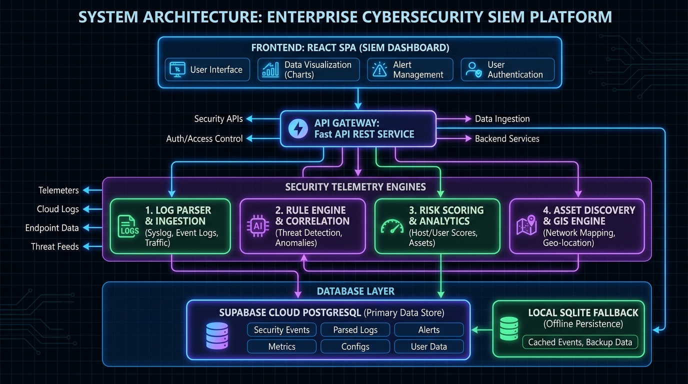
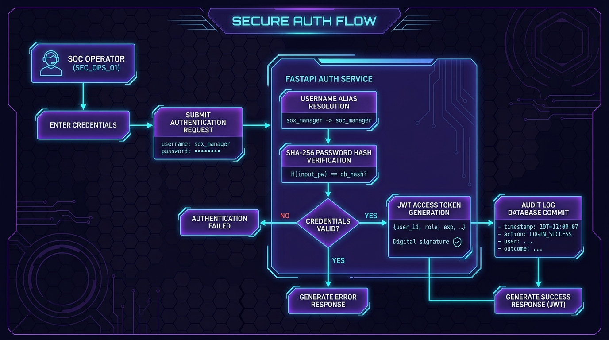
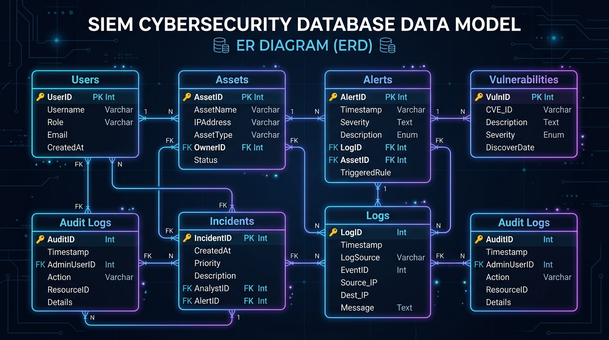
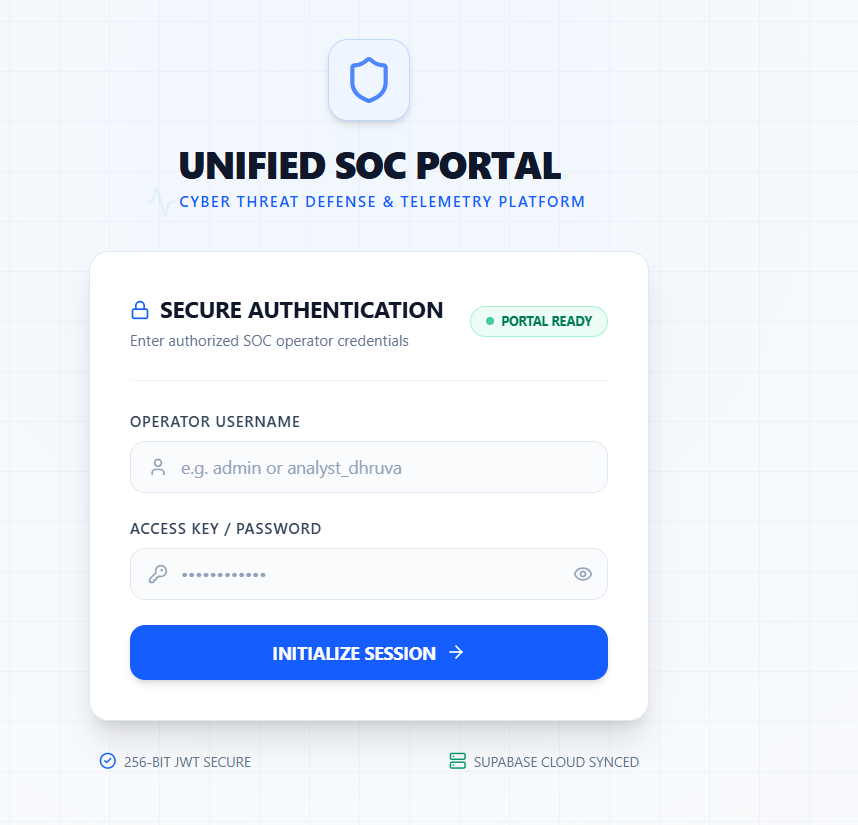
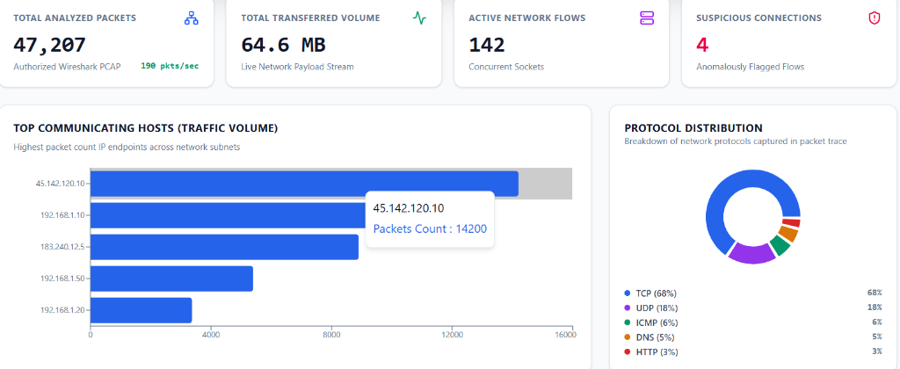
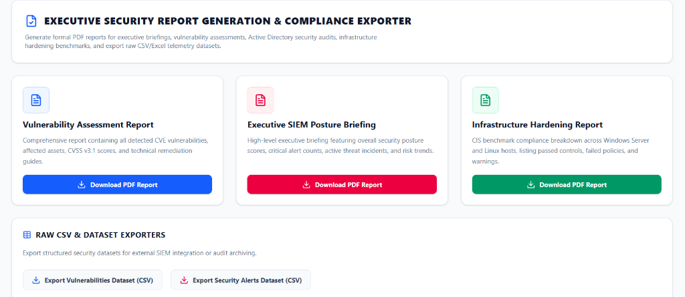

<div align="center">

# 🛡️ Unified Cyber Defense Platform — SIEM Command Center

### *Enterprise-Grade Security Information & Event Management System*
**CompTIA Security+ SY0-701 Capstone Demonstration Platform**

[](https://unified-cyber-defence.netlify.app/)
[](https://github.com/kharedhruva-tech/Unified-Cyber-Defense-Platform-SIEM-Command-Center)
[](https://github.com/kharedhruva-tech/Unified-Cyber-Defense-Platform-SIEM-Command-Center)
[](https://react.dev/)
[](https://fastapi.tiangolo.com/)
[](https://supabase.com/)
[](LICENSE)

[🌐 **Explore Live Demo Console**](https://unified-cyber-defence.netlify.app/) • [📂 **GitHub Source Repository**](https://github.com/kharedhruva-tech/Unified-Cyber-Defense-Platform-SIEM-Command-Center) • [📖 **Architecture Specs**](#-system-architecture--technical-design)

---

</div>

## 📖 Executive Summary

The **Unified Cyber Defense Platform** is a full-stack, enterprise-ready **Security Information and Event Management (SIEM) Command Center**. It aggregates telemetry across endpoints, perimeter firewalls, Active Directory domain controllers, network probes, and cloud assets into a single operational dashboard.

Engineered to satisfy all practical capabilities of the **CompTIA Security+ SY0-701 Certification Curriculum**, this platform demonstrates hands-on implementation of threat intelligence correlation, credentialed vulnerability management, packet capture analysis, identity governance, automated infrastructure hardening, and SOAR-style incident containment.

### 🔗 Key Operational Links
- **Production Console**: [https://unified-cyber-defence.netlify.app/](https://unified-cyber-defence.netlify.app/)
- **Source Code**: [https://github.com/kharedhruva-tech/Unified-Cyber-Defense-Platform-SIEM-Command-Center](https://github.com/kharedhruva-tech/Unified-Cyber-Defense-Platform-SIEM-Command-Center)

---

## ⚡ Core Capabilities & Feature Matrix

| Domain Module | Primary Capabilities | Technical Highlights |
| :--- | :--- | :--- |
| **🤖 AI Security Copilot** | Automated threat triage, incident explanations, voice command dictation, dynamic playbook generation. | Plain-English markdown parsing, context-aware prompt routing, auto-scroll telemetry feed. |
| **🌐 WebGL 3D Threat Globe** | 3D interactive global threat visualization, active IOC monitoring, real-time exfiltration node tracing. | Three.js rendering engine, dynamic flight-arc trajectories, camera focus controls. |
| **🗺️ GIS Breach Heatmap** | Geolocation threat mapping, compromised host tracking, single-click IP firewall containment. | Leaflet GIS mapping, country flag resolution, automated Cloudflare WAF block triggers. |
| **⚡ SIGMA Correlation Engine** | Rule-based event correlation, brute-force spike detection, Kerberos ticket anomaly flags. | Real-time pattern evaluation, custom SIGMA JSON rule builder, threshold windows. |
| **🔐 Active Directory & GPO** | Domain user auditing, privileged group tracking, Kerberos hygiene checks, GPO password compliance. | AD DS auditing, privileged account flagging, bad password count metrics. |
| **📡 Wireshark & PCAP Capture** | Live packet inspection, protocol analysis (TCP/UDP/ICMP/ARP), DNS tunneling detection. | Packet burst simulator, Wireshark stream ticker, flow indicator breakdown. |
| **📊 Executive Reporting & SOAR** | Automated PDF briefing export, CSV dataset export, web push notifications, Slack/Discord webhooks. | ReportLab PDF engine, Slack block kit payloads, multi-format export. |

---

## 🏗️ System Architecture & Technical Design

The platform uses a decoupled, high-throughput micro-architecture separating the real-time React telemetry dashboard from the FastAPI backend and Supabase datastore.

```mermaid
graph TD
    User([SOC Analyst / Operator]) -->|HTTPS / TLS 1.3| ReactFrontend[React 18 + Vite SOC Dashboard]
    
    subgraph Frontend Client (Netlify CDN)
        ReactFrontend --> Modules[Dashboard, GIS Map, AD Audit, Log Stream, Network Capture]
        ReactFrontend --> LocalState[Local Telemetry & Egress Caching Layer]
    end

    subgraph Backend Services (Python FastAPI)
        ReactFrontend -->|REST API v1| FastAPIServer[FastAPI Application Server]
        FastAPIServer --> RuleEngine[SIGMA Threat Detection Engine]
        FastAPIServer --> PcapEngine[PCAP Packet Inspection Engine]
        FastAPIServer --> GisEngine[GIS Breach & Geolocation Engine]
        FastAPIServer --> ADService[Active Directory Audit Engine]
    end

    subgraph Data & Cloud Datastore
        FastAPIServer -->|SQLAlchemy ORM| PostgresDB[(PostgreSQL / Supabase Datastore)]
        ReactFrontend -.->|Direct REST Backup (Egress-Optimized)| SupabaseREST[Supabase REST API]
    end

    subgraph External Notification Integrations
        FastAPIServer -->|Webhooks| WebhookDest[Slack / Discord Webhooks]
        FastAPIServer -->|PDF Export| ReportGen[Executive PDF Generator]
    end
```

### 🖼️ Architecture & Database Schemas
| System Architecture | Authentication Flow | Database ERD Schema |
| :---: | :---: | :---: |
|  |  |  |

---

## 🎓 CompTIA Security+ SY0-701 Mapping

This project maps directly to the 5 core domains of the **CompTIA Security+ SY0-701** exam objectives:

```
CompTIA Security+ SY0-701 Objective Coverage:
 ├── Domain 1: General Security Concepts (12%)      --> Control types, CIA Triad, Security Controls
 ├── Domain 2: Threats, Vulnerabilities & Mitigations (22%) --> CVE Analysis, Exploits (MS17-010), Brute Force
 ├── Domain 3: Security Architecture (18%)          --> Network Topology, DMZ, Firewall Policy, Cloud GIS
 ├── Domain 4: Security Operations (28%)            --> SIEM Engine, Log Analytics, PCAP Capture, Incident SOAR
 └── Domain 5: Security Program Management (20%)   --> Compliance Audit Trails, Executive PDF Reports, RBAC
```

| Security+ SY0-701 Module | Applied Tool / Protocol | Project Implementation |
| :--- | :--- | :--- |
| **Lesson 1: Security Controls** | RBAC, Least Privilege | Multi-tier role permissions (`Admin`, `Manager`, `Analyst`, `Auditor`). |
| **Lesson 2: Threat Detection** | SIGMA, Event Logs | Automated detection rules for Event ID 4625 & SSH brute-force spikes. |
| **Lesson 7: Infrastructure** | Kali Linux, Windows Server 2022 | Baseline hardening benchmarks & CIS compliance auditing. |
| **Lesson 8: Vulnerability Mgmt** | Nessus, Metasploit, CVSS | Credentialed vulnerability scoring for MS17-010 EternalBlue & OpenSSH. |
| **Lesson 10: Identity & Access** | Active Directory, GPO, Kerberos | Domain Controller security audits, password lockout thresholds, user status. |

---

## 🖼️ Platform Interface Showcase

Source Code: [https://github.com/kharedhruva-tech/Unified-Cyber-Defense-Platform-SIEM-Command-Center](https://github.com/kharedhruva-tech/Unified-Cyber-Defense-Platform-SIEM-Command-Center)

<div align="center">

### 🛡️ SOC Central Command Center Dashboard


### 🔐 Multi-Role Authentication & Access Portal


### 📡 Real-Time Packet Capture & Network Analysis


### 📄 Executive Security Reports & Compliance Exporter


</div>

---

## 🛠️ Technology Stack

```text
Frontend Framework:   React 18.3 + Vite 5
Styling Engine:       Tailwind CSS v3 + Lucide Icons
Data Visualization:   Three.js (3D WebGL), Leaflet GIS, Recharts
Backend Framework:    Python 3.10+ & FastAPI
ORMs & Database:      SQLAlchemy, SQLite, Supabase PostgreSQL
Reporting & Export:   ReportLab (PDF), CSV Engine
Containerization:     Docker & Docker Compose
Deployment:           Netlify CDN (Client), Docker / Cloud Host (API)
```

---

## 🔑 Default RBAC Login Credentials

The application enforces **Role-Based Access Control (RBAC)** across all modules:

| Role Tier | Username | Default Password | Granted Permissions |
| :--- | :--- | :--- | :--- |
| **👑 Admin** | `admin` | `admin123` | Full Administrative & System Control |
| **🛡️ SOC Manager** | `manager` | `admin123` | Incident Escalation, Containment & Reporting |
| **🔍 Security Analyst** | `analyst` | `admin123` | Event Log Triage, PCAP Analysis & Alerts |
| **📋 Compliance Auditor** | `auditor` | `admin123` | Read-Only Governance & Compliance Audit |

---

## 🚀 Quick Start & Installation Guide

### Prerequisites
- **Node.js**: v18.0.0 or higher
- **Python**: v3.10.0 or higher
- **Git**: Installed

### 1. Clone Repository
```bash
git clone https://github.com/kharedhruva-tech/Unified-Cyber-Defense-Platform-SIEM-Command-Center.git
cd Unified-Cyber-Defense-Platform-SIEM-Command-Center
```

### 2. Backend Setup (FastAPI)
```bash
cd backend

# Create Virtual Environment
python -m venv venv

# Activate Environment (Windows)
.\venv\Scripts\activate

# Activate Environment (Linux/macOS)
source venv/bin/activate

# Install Dependencies & Run
pip install -r requirements.txt
python run.py
```
*Backend API available at: `http://localhost:8000/api/v1`*

### 3. Frontend Setup (React + Vite)
```bash
cd frontend

# Install Node Modules
npm install

# Launch Vite Dev Server
npm run dev
```
*Frontend Console available at: `http://localhost:5173`*

### 4. Docker Deployment (Single Command)
```bash
docker-compose up --build -d
```

---

## 📡 API Endpoint Overview

| HTTP Method | Endpoint | Description |
| :--- | :--- | :--- |
| `POST` | `/api/v1/auth/login` | User authentication & JWT issuance |
| `GET` | `/api/v1/reports/summary` | Executive SIEM posture score & summary metrics |
| `GET` | `/api/v1/logs` | Query normalized security logs with type filtering |
| `GET` | `/api/v1/threat-detection/alerts` | Fetch active security alerts correlated by engine |
| `POST` | `/api/v1/incidents/action/{type}` | Execute automated SOAR containment (Host Isolation, Firewall Block) |
| `GET` | `/api/v1/gis/breaches` | Geolocation breach data feed for 3D/GIS mapping |
| `GET` | `/api/v1/reports/download/pdf` | Download formatted PDF executive compliance briefing |

---

## ⚡ Performance & Cloud Egress Optimization

To ensure seamless production deployment on **Netlify** and **Supabase Free Tier**, the platform incorporates enterprise performance optimizations:

- **15-Minute Session Caching**: Prevents excessive API roundtrips by caching directory queries in `sessionStorage`.
- **Column Filtering & Response Caps**: Uses Supabase REST selectors (`select=id,username,email,role&limit=20`) to minimize egress payload.
- **Safe Date Utility Parsing**: Includes a custom date parser ([`frontend/src/utils/dateUtils.ts`](frontend/src/utils/dateUtils.ts)) to parse ISO 8601, UTC, and time-only strings without encountering `"Invalid Date"` errors.

---

## 📂 Project Directory Structure

```text
Unified-Cyber-Defense-Platform-SIEM-Command-Center/
├── assets/                  # High-resolution screenshots & architecture diagrams
├── backend/                 # FastAPI Application Server
│   ├── app/                 # API controllers, engines, models & schemas
│   │   ├── api/             # REST endpoints (auth, logs, alerts, incidents, GIS)
│   │   ├── core/            # Config, security & DB session setup
│   │   ├── engines/         # Rule engine, PCAP inspector, AD audit engine
│   │   ├── models/          # SQLAlchemy database models
│   │   └── schemas/         # Pydantic request/response validation
│   ├── run.py               # Backend entrypoint
│   └── requirements.txt     # Python backend dependencies
├── frontend/                # React 18 + Vite SOC Dashboard
│   ├── src/                 # Application source
│   │   ├── components/      # UI components (modules & common widgets)
│   │   ├── config/          # RBAC rules & fallback mock telemetry
│   │   ├── services/        # Axios API client & notification services
│   │   ├── utils/           # Date formatting & safe parsing utilities
│   │   └── types/           # TypeScript interfaces & types
│   ├── package.json         # Frontend dependencies
│   └── vite.config.ts       # Vite bundler configuration
├── docker-compose.yml       # Container orchestration configuration
├── netlify.toml             # Netlify deployment & SPA rewrite rules
└── README.md                # Platform documentation
```

---

## 👨‍💻 Author & Attribution

Developed by **Dhruva Khare** as a Capstone Demonstration Project for the **CompTIA Security+ SY0-701** Certification.

- **GitHub**: [@kharedhruva-tech](https://github.com/kharedhruva-tech)
- **Live Demo**: [https://unified-cyber-defence.netlify.app/](https://unified-cyber-defence.netlify.app/)
- **Repository**: [Unified-Cyber-Defense-Platform-SIEM-Command-Center](https://github.com/kharedhruva-tech/Unified-Cyber-Defense-Platform-SIEM-Command-Center)

---

<div align="center">

**🛡️ Unified Cyber Defense Platform — Built for Real-World Security Operations**

[Back to top ↑](#-unified-cyber-defense-platform--siem-command-center)

</div>
