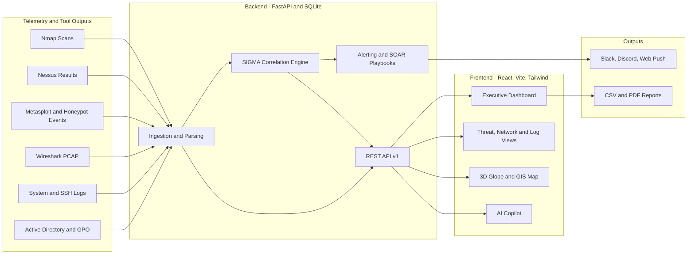

<div align="center">

# 🛡️ Unified Cyber Defense Platform
### SIEM Command Center · CompTIA Security+ SY0-701 Course-End Project

**A unified security operations console that brings threat detection, vulnerability management, log analytics, packet analysis, identity security and system hardening into a single pane of glass.**


[](https://unified-cyber-defence.netlify.app/)

### 🌐 [**Launch Live Demo →**](https://unified-cyber-defence.netlify.app/)

[Live Demo](#-live-demo) · [Overview](#-overview) · [Features](#-key-features) · [Screenshots](#-screenshots) · [Architecture](#-architecture) · [Quick Start](#-quick-start) · [Modules](#-platform-modules) · [Security](#-security-considerations) · [Roadmap](#-roadmap)

<br/>


<sub><i>SOC Central Command Center: real-time posture score, live log capture and key SOC metrics</i></sub>

</div>

---

## 🌐 Live Demo

The frontend console is deployed on Netlify:

**👉 https://unified-cyber-defence.netlify.app/**

The deployment is configured through [`netlify.toml`](netlify.toml). To run the full stack (FastAPI backend, SQLite) locally instead, see [Quick Start](#-quick-start).

---

## 📖 Overview

The **Unified Cyber Defense Platform** is a full-stack SIEM (Security Information and Event Management) command center built to satisfy the **CompTIA Security+ SY0-701 Course-End Project**. Instead of stitching together separate tools and screenshots, it consolidates the outputs of the standard security toolchain into one operational console modelled on how a real Security Operations Center (SOC) works.

The platform covers the full defensive lifecycle:

| Phase | What the platform does |
|---|---|
| **Discover** | Subnet and service discovery, live host and open-port enumeration |
| **Assess** | Credentialed vulnerability scanning with CVE and severity scoring |
| **Detect** | SIGMA-rule correlation over streaming telemetry, log analytics, packet inspection |
| **Respond** | One-click playbooks, automated IP containment, multichannel alerting |
| **Harden** | Active Directory and Group Policy auditing, baseline configuration enforcement |
| **Report** | CSV export and PDF reporting for stakeholders |

---

## 🚀 Key Features

- **🤖 AI Security Copilot** — Plain-English threat analysis with voice dictation, Markdown code blocks, one-click playbook execution and an auto-refreshing live log and alert ticker.
- **🌐 3D Interactive Attack Globe** — Real-time WebGL (Three.js) visualization of active attack vectors and perimeter nodes.
- **🗺️ GIS Breach Heatmap** — Live IP geolocation breach tracking (Leaflet) with automated firewall IP containment.
- **⚡ SIGMA Correlation Engine** — Detection rules evaluated against streaming telemetry to surface threats automatically.
- **🔐 Active Directory & GPO Auditor** — Audits AD users, security groups, Kerberos tickets and Group Policy password and lockout rules.
- **🔎 Vulnerability Management** — Nessus-style credentialed scan results with CVE scoring and remediation tracking.
- **📡 Network Intelligence** — PCAP inspection covering ARP spoofing, MITM indicators and TLS certificate and cipher validation.
- **📊 Notifications & Reporting** — Web Push, Slack and Discord webhooks, CSV export and PDF report downloads.
- **🚨 Incident Management** — Track open response tickets and active incidents alongside live alerts.
- **👥 Role-Based Access** — Separate Admin, SOC Manager and Analyst roles behind a JWT-secured login portal.

---

## 📸 Screenshots

### SIEM Command Center *(shown above)*
Security posture score, live captured log stream, and headline SOC metrics (total events, critical and high-risk alerts, failed logins, monitored assets, open CVEs, suspicious IPs and active incidents) with live capture controls and on-demand correlation rules.

### Network Intelligence
Wireshark PCAP analysis with total analyzed packets, transferred volume, active flows and flagged connections, plus top communicating hosts by traffic volume and a protocol distribution breakdown.


### Log Analytics
Centralized log ingestion with normalized telemetry, failed login tracking (Event ID 4625 / SSH), valid authentications, privilege-change events and an overall log health score.


### Secure Operator Login
Role-based, JWT-secured authentication portal for SOC operators.

<div align="center">
  
</div>

---

## 🏗️ Architecture



> For deeper detail see [`architecture.md`](architecture.md) and [`design.md`](design.md).

### Tech Stack

| Layer | Technology |
|---|---|
| **Frontend** | React, Vite, Tailwind CSS, Three.js (attack globe), Leaflet (GIS map) |
| **Backend** | Python 3.10+, FastAPI |
| **Database** | SQLite |
| **Auth & Sync** | JWT authentication, Supabase cloud sync |
| **Deployment** | Docker Compose, Netlify (frontend) - [live site](https://unified-cyber-defence.netlify.app/) |

---

## 🧰 Security+ SY0-701 Technology & Tools Matrix

| Category | Technology / Tool | Purpose in Project | Platform Module |
|---|---|---|---|
| **Operating Systems** | Kali Linux & Windows Server 2022 | Baseline security testing environment and enterprise Domain Controller target | System Hardening · Active Directory |
| **Network Scanning** | Nmap | Service discovery, live host detection, open-port enumeration | Asset Discovery (`/assets`) |
| **Vulnerability Assessment** | Tenable Nessus Expert | Credentialed scanning of Windows Server 2022 with CVE scoring | Vulnerability Management (`/vulnerabilities`) |
| **Penetration Testing** | Metasploit Framework | MS17-010 SMB validation and honeypot attack testing | Threat Detection (`/threat-detection`) |
| **Network Analysis** | Wireshark & PCAP Inspector | Packet capture, ARP spoofing detection, MITM analysis, TLS inspection | Network Intelligence (`/network`) |
| **Log Analysis** | System & SSH Logs | Event parsing, failed-login spike and brute-force detection | Log Analytics (`/logs`) |
| **SIEM Concepts** | Unified SIEM Engine | Correlating logs, alerts and SIGMA rules across endpoints | Executive Dashboard · Security Alerts |
| **Scripting & Automation** | Bash / Shell & Python | Log parsing, detection rules, automated SOAR response | Threat Engine · AI Copilot |
| **Identity & Access** | Active Directory (AD DS) | Domain Controller roles, Security Groups, OUs, user accounts | Active Directory (`/active-directory`) |
| **Security Policies** | Group Policy (GPO) | Password and lockout rules, infrastructure hardening | System Hardening (`/hardening`) |
| **Network Security** | HTTPS / SSL / TLS | Certificate validation, cipher inspection, encrypted payloads | Network Intelligence (`/network`) |
| **Cloud Security** | Cloud resources & GIS map | Breach geo-mapping, perimeter security, IP containment | GIS Breach Map (`/gis-map`) |

---

## 🧩 Platform Modules

| Module | Route | Description |
|---|---|---|
| Executive Dashboard | `/` | High-level posture, KPIs and live alert feed |
| Security Alerts | `/alerts` | Triage queue fed by the SIGMA correlation engine |
| Incident Management | `/incidents` | Open response tickets and active incident tracking |
| Asset Discovery | `/assets` | Hosts, services and open ports from subnet scans |
| Vulnerability Management | `/vulnerabilities` | Credentialed scan findings, CVE and severity scoring |
| Threat Detection | `/threat-detection` | Exploit and honeypot events, detection rule matches |
| Network Intelligence | `/network` | PCAP analysis, ARP/MITM detection, TLS inspection |
| Log Analytics | `/logs` | System and SSH log search, brute-force and anomaly detection |
| Active Directory | `/active-directory` | Users, groups, Kerberos and GPO password-policy audit |
| System Hardening | `/hardening` | Baseline checks and Group Policy enforcement status |
| GIS Breach Map | `/gis-map` | Geolocated attacker IPs with automated containment |

> Route paths for the Dashboard, Alerts and Incident Management views are indicative. Adjust them to match your router configuration.

---

## ⚡ Quick Start

### Prerequisites

- **Python** 3.10 or newer
- **Node.js** 18 or newer, with `npm`
- *(Optional)* **Docker** and **Docker Compose**

### Option A — Local Development

**1. Backend (FastAPI + SQLite)**

```bash
cd backend
python -m venv venv

# Windows
.\venv\Scripts\activate
# Linux / macOS
source venv/bin/activate

pip install -r requirements.txt
python run.py
```

The API is served at `http://localhost:8000/api/v1`.

**2. Frontend (React + Vite + Tailwind)**

```bash
cd frontend
npm install
npm run dev
```

The app is served at `http://localhost:5173`.

### Option B — Docker Compose

```bash
docker compose up --build
```

### Default Credentials (Lab Use Only)

| Role | Username | Password |
|---|---|---|
| Administrator | `admin` | `admin123` |
| SOC Manager | `manager` | `manager123` |
| Analyst | `analyst` | `analyst123` |

> ⚠️ **These are demo credentials for the isolated lab environment.** Change them, or disable the seed accounts, before exposing the platform on any shared or public network.

---

## 📁 Repository Structure

```text
.
├── assets/
│   └── screenshots/      # README screenshots (dashboard, network, logs, login)
├── backend/              # FastAPI service, SIGMA engine, SQLite persistence
├── frontend/             # React + Vite + Tailwind console
├── architecture.md       # System architecture
├── design.md             # UI / UX design decisions
├── prd.md                # Product requirements
├── rules.md              # Detection and project rules
├── tasks.md              # Task breakdown
├── memory.md             # Project notes and context
├── docker-compose.yml    # Container orchestration
└── netlify.toml          # Frontend deployment config
```

---

## 🎓 Course Alignment

| Tasks | Lesson | Coverage |
|---|---|---|
| **Task 1** | Lesson 7 — Establishing a Secure Foundation | Kali Linux security baseline |
| **Tasks 2–4** | Lesson 8 — Application and System Security | Nessus credentialed scans, Metasploit MS17-010 validation |
| **Tasks 5–7** | Lesson 2 — Detecting & Correlating Security Threats | Wireshark PCAP analysis, shell automation |
| **Tasks 8–10** | Lesson 10 — Identity, Access, and Incident Management | AD DS, security groups, GPO policies |

---

## 🔒 Security Considerations

- Run this platform only inside an **isolated lab** or a network you own and are authorized to test.
- Replace all default credentials and any signing secrets before deployment.
- Keep webhook URLs (Slack, Discord) and API keys in environment variables, never in source control.
- Place the API behind HTTPS and a reverse proxy if it is exposed beyond localhost.
- Offensive tooling referenced here (Nmap, Metasploit) is used strictly for **authorized, educational** validation against lab targets.

---

## 🗺️ Roadmap

- [ ] Live log ingestion via syslog / agent forwarders
- [ ] Expanded SIGMA rule library with MITRE ATT&CK mapping
- [ ] Persistent case management and incident timelines
- [ ] Pluggable threat-intelligence feeds
- [ ] PostgreSQL backend option for multi-user deployments
- [ ] Automated test suite and CI pipeline

---

## 🤝 Contributing

Contributions, issues and feature requests are welcome.

1. Fork the repository
2. Create a feature branch: `git checkout -b feature/your-feature`
3. Commit your changes: `git commit -m "Add your feature"`
4. Push the branch: `git push origin feature/your-feature`
5. Open a Pull Request

---

## 📜 License

No license file is currently included. Add a `LICENSE` (for example MIT) to define how others may use this project.

---

<div align="center">

**Built by [@kharedhruva-tech](https://github.com/kharedhruva-tech)**

*If this project helped you, consider giving it a ⭐*

</div>
