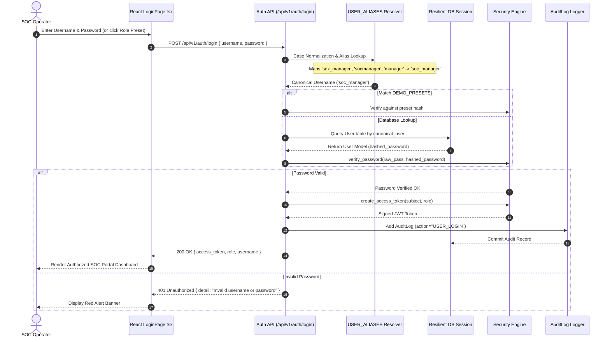
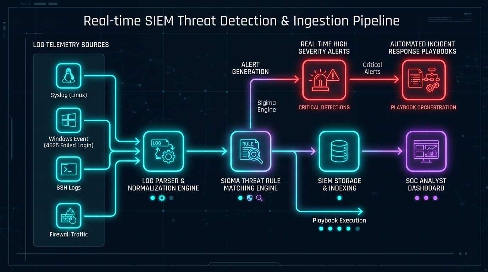
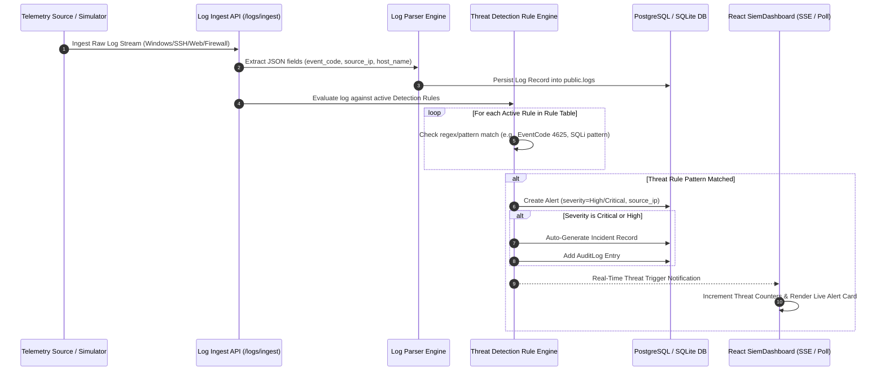
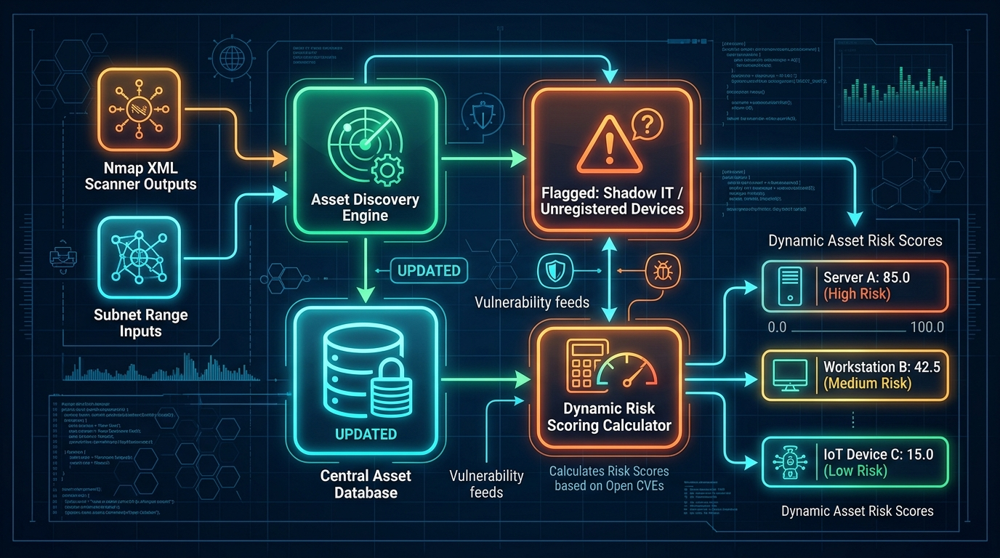
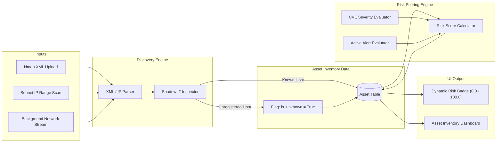
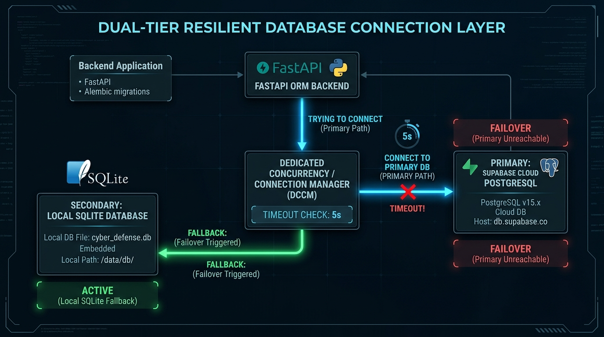
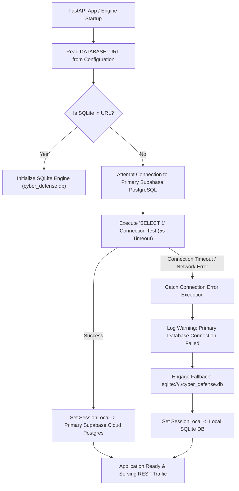
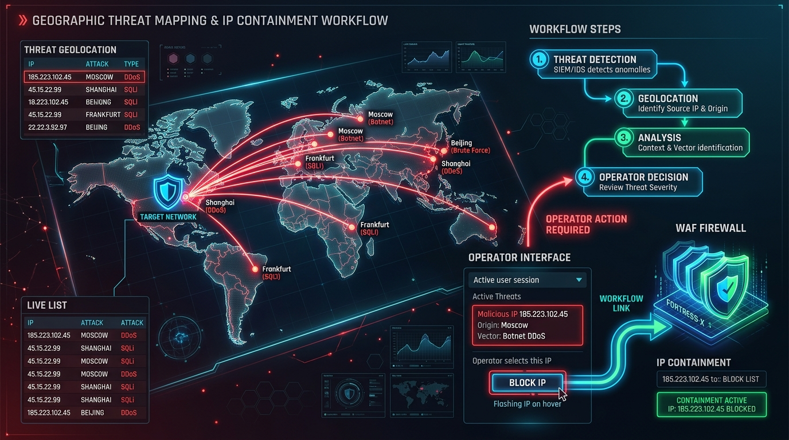
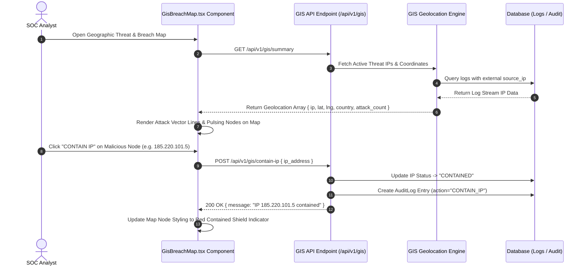
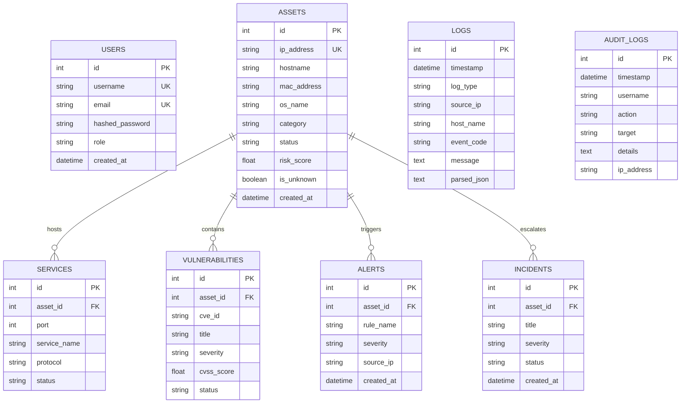

# System Architecture & Technical Specifications
## Unified Cyber Defense Solution

---

### 1. High-Level System Architecture

This diagram presents the core multi-layer architecture of the Unified Cyber Defense Solution, showing the flow from the React Single Page Application (SPA) frontend to the FastAPI REST API gateway, the decoupled analytical telemetry engines, and the resilient dual-tier database layer.


```mermaid
graph TD
    subgraph Client Layer (React 18 SPA)
        UI["React SPA (Vite 5 + TypeScript)"]
        AuthGuard["JWT Auth Guard & Presets"]
        SiemMod["SIEM Live Dashboard"]
        GisMod["GIS Threat Map (Canvas)"]
        AssetMod["Asset Inventory & Scan View"]
        AdMod["Active Directory Audit View"]
        IncMod["Incident Response Board"]
    end

    subgraph API Gateway & Middleware Layer (FastAPI)
        Router["APIRouter (/api/v1)"]
        CORS["CORSMiddleware"]
        LogMiddleware["HTTP Logging & Audit Middleware"]
        SecurityHandler["SHA-256 / JWT Auth Handler"]
    end

    subgraph Analytical & Telemetry Engines Layer
        SimEngine["Activity Simulator Engine"]
        LogParser["Log Parser Engine"]
        RuleEngine["Threat Detection Rule Engine"]
        DiscEngine["Asset Discovery Engine"]
        RiskEngine["Risk Scoring Engine"]
        GisEngine["GIS Geolocation Engine"]
        PcapEngine["PCAP DPI Engine"]
        AdEngine["AD Security Audit Engine"]
        ReportEngine["Report Generator"]
    end

    subgraph Resilient Data Layer
        SQLA["SQLAlchemy 2.0 ORM + Pydantic"]
        Supabase["Primary: Supabase PostgreSQL (Cloud)"]
        SQLite["Fallback: Local SQLite (cyber_defense.db)"]
    end

    UI --> AuthGuard
    AuthGuard --> SiemMod & GisMod & AssetMod & AdMod & IncMod
    SiemMod & GisMod & AssetMod & AdMod & IncMod --> Router
    Router --> CORS --> LogMiddleware --> SecurityHandler

    SecurityHandler --> SimEngine & LogParser & RuleEngine & DiscEngine & RiskEngine & GisEngine & PcapEngine & AdEngine & ReportEngine

    SimEngine & LogParser & RuleEngine & DiscEngine & RiskEngine & GisEngine & PcapEngine & AdEngine & ReportEngine --> SQLA

    SQLA -->|Primary Connection| Supabase
    SQLA -.->|Failover on Connection Timeout| SQLite
```

---

### 2. Authentication & User Alias Resolution Flow

This sequence diagram illustrates how operator login requests are processed, including automatic username alias normalization (`sox_manager` → `soc_manager`), password verification, JWT creation, and audit logging.




---

### 3. Real-Time Telemetry & Threat Detection Pipeline

This sequence diagram traces incoming log streams from raw ingestion to rule evaluation, alert creation, and automated incident response triggers.





---

### 4. Asset Discovery & Risk Scoring Architecture

This diagram illustrates how network scan data or Nmap XML imports are ingested by the Discovery Engine, updated in the inventory, and evaluated by the Risk Scoring Engine.





---

### 5. Dual-Tier Database Resiliency & Failover Flow

This flowchart explains the automatic database connection failover mechanism implemented in `app/core/database.py`.





---

### 6. GIS Geolocation & Threat Containment Flow

This sequence diagram depicts how external threat IP addresses are mapped geolocationaly and contained via the interactive GIS Threat Map.





---

### 7. Entity Relationship Diagram (ERD)

This diagram visualizes the relational schema stored in Supabase PostgreSQL / SQLite.




---

### 8. Summary of Engine Responsibilities

| Engine Module | Primary File | Responsibilities |
| :--- | :--- | :--- |
| **Activity Simulator** | `simulator_engine.py` | Generates synthetic enterprise log telemetry (SSH, Windows 4625/4728, Web SQLi attacks) |
| **Log Parser** | `log_parser_engine.py` | Extracts structured JSON attributes (`target_username`, `uri`, `failure_reason`) from syslog |
| **Rule Detection** | `rule_detection_engine.py` | Matches incoming events against active rules and auto-generates alerts & incidents |
| **Asset Discovery** | `discovery_engine.py` | Scans subnet ranges, identifies Shadow IT devices, parses Nmap XML files |
| **Risk Scoring** | `risk_scoring_engine.py` | Dynamically updates asset risk scores based on open vulnerabilities and alert frequency |
| **GIS Geolocation** | `gis_engine.py` | Computes latitude/longitude for threat IPs, draws attack paths, manages IP containment |
| **PCAP Inspection** | `pcap_engine.py` | Performs Deep Packet Inspection simulation, protocol breakdown, and bandwidth tracking |
| **AD Security Audit** | `ad_security_engine.py` | Audits Domain Admins, accounts with expired passwords, and Kerberos ticket health |
| **Log Dependency** | `log_dependency_engine.py` | Builds host communication graphs from network log interaction records |
| **Infrastructure Hardening**| `hardening_engine.py` | Verifies system settings against CIS Benchmark standards for Windows/Linux |
| **Report Generator** | `report_generator.py` | Compiles executive summaries into downloadable PDF and CSV reports |
